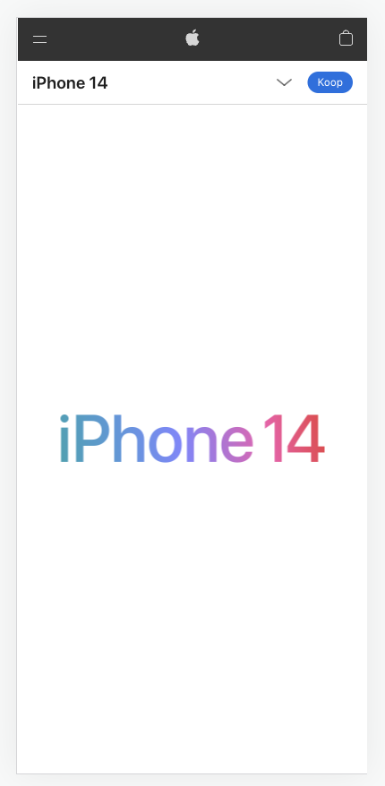
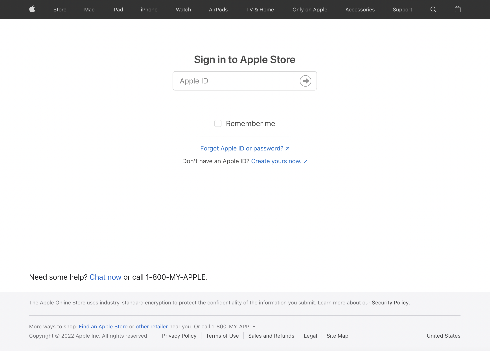
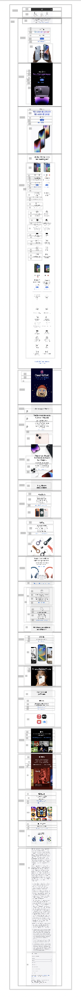
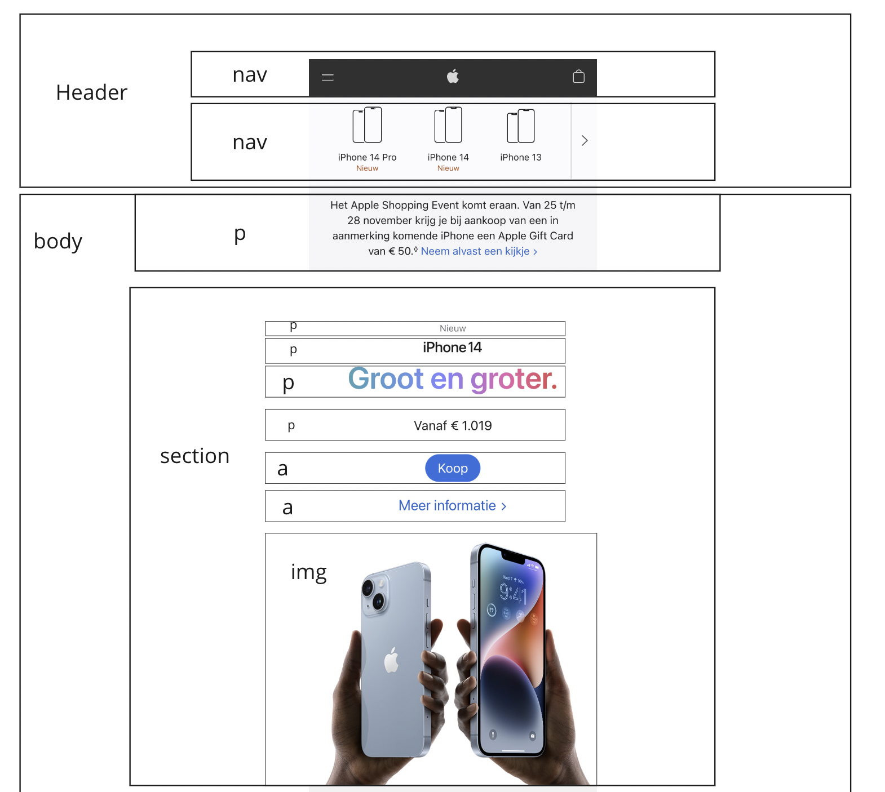
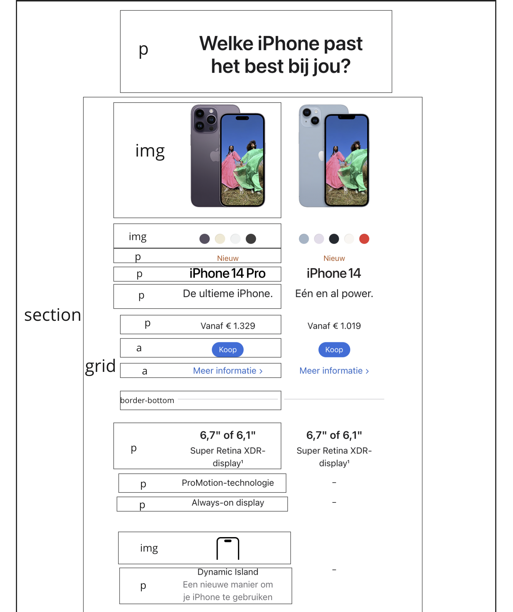
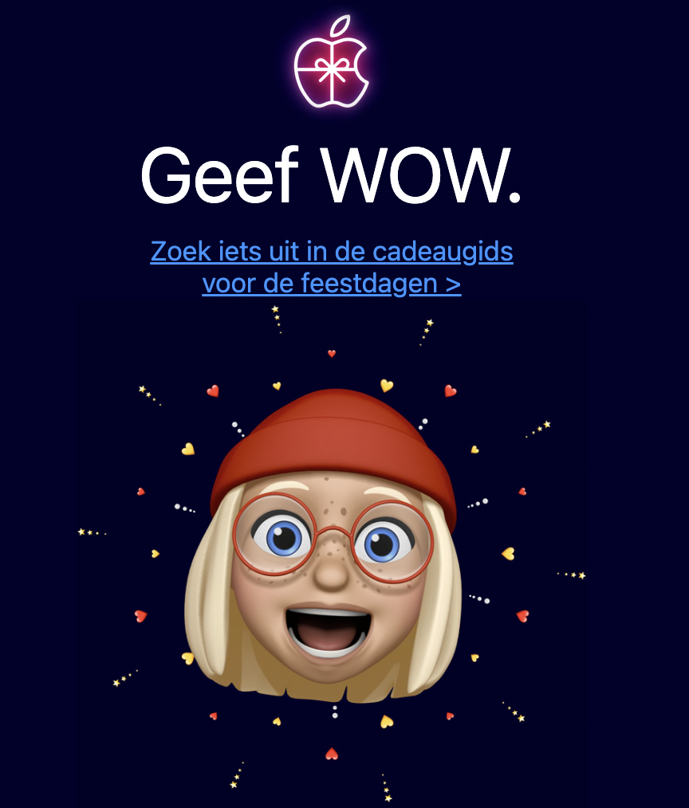
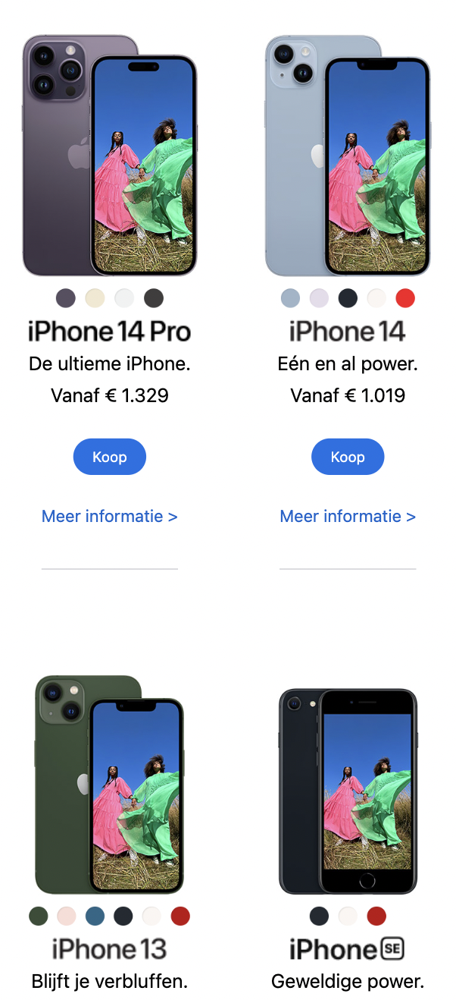
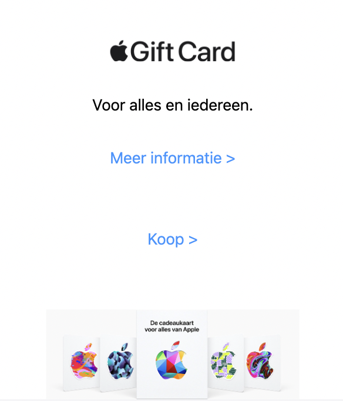

# Procesverslag
Markdown is een simpele manier om HTML te schrijven.  
Markdown cheat cheet: [Hulp bij het schrijven van Markdown](https://github.com/adam-p/markdown-here/wiki/Markdown-Cheatsheet).

Nb. De standaardstructuur en de spartaanse opmaak van de README.md zijn helemaal prima. Het gaat om de inhoud van je procesverslag. Besteedt de tijd voor pracht en praal aan je website.

Nb. Door *open* toe te voegen aan een *details* element kun je deze standaard open zetten. Fijn om dat steeds voor de relevante stuk(ken) te doen.

## Jij

  
uitwerken voor kick-off werkgroep

  ### Auteur:
  Leon Zethof

  #### Je startniveau:
  blauw

  #### Je focus:
  surface plane

## Je website

  
uitwerken voor kick-off werkgroep

  ### Je opdracht:
  link naar de website die je gaat namaken óf de naam/omschrijving van je eigen ontwerp
  https://www.apple.com/nl/iphone/
  #### Screenshot(s) van de eerste pagina (small screen): 
  hier de naam van de pagina  
  

  #### Screenshot(s) van de tweede pagina (small screen):
  hier de naam van de pagina  
  
 

## Toegankelijkheidstest 1/2 (week 1)

  
uitwerken na test in 1e werkgroep

  ### Bevindingen
  Lijst met je bevindingen die in de test naar voren kwamen:
  -alles is tab baar
  -letters groot genoeg

  #### Screenreader
  Een screenreader leest voor wat er op je beeldscherm staat voor mensen die niet goed kunnen zien.
  Door alternatieve teksten naast plaatjes en dingen in het menu te zetten kan de screen reader het uitlezen

  #### Muis en Toetsenbord 
  Alles dat aan moet worden geklikt moet ook echt aan kunnen worden geklikt met een muis.
  Door een focus state toe te voegen aan de klikbare objecten kan er goed worden gezien op welk element gefocust word als er met de tab knop door het document heen word gehaald.

  #### Motoriek (shocks, elastiekjes)
  Voor de mensen waarvan de motoriek gehinderd word is het belangrijk dat ze ook nogsteeds de website kunnen bedienen, dit door kan gedaan worden door alle objecten genoeg ruimte te geven en tabbaar te maken.

  #### Visueel (brillen, contrast, kleurenblind, dark/light). 
  Sommige mensen hebben een visuele beperking en hier kan rekening mee worden door het contrast goed te houden en ervoor zorgen dat het lettertype groot genoeg is en er alternatieve plaatjes zijn voor kleurenblinden.

## Breakdownschets (week 1)

  
uitwerken na afloop 2e werkgroep

  ### de hele pagina: 
  

  ### dynamisch deel (bijv menu): 
  

  ### wellicht nog een dynamisch deel (bijv filter): 
  

## Voortgang 1 (week 2)

  
uitwerken voor 1e voortgang

  ### Stand van zaken
  hier dit ging goed & dit was lastig (neem ook screenshots op van delen van je website en code)

  ### Agenda voor meeting
  samen met je groepje opstellen

  | LEon zethof    | Quintijn           | student 3    | student 4        |
  | ---            | ---                | ---          | ---              |
  | grid en footer | hoeveel ik van je  | en ik dit    | en dan ik dat    |
  | en dat ook nog | hou                | nog een punt | dit wil ik zeker |
  | ...            | ...                | ...          | ...              |

  ### Verslag van meeting
  hier na afloop snel de uitkomsten van de meeting vastleggen

  - niet alles door elkaar heen doen
  - meer info volgende week
  - nog een punt
  - ...

## Voortgang 2 (week 3)

  
uitwerken voor 2e voortgang

  ### Stand van zaken
  hier dit ging goed & dit was lastig (neem ook screenshots op van delen van je website en code)

  ### Agenda voor meeting
  samen met je groepje opstellen

  | Leon zethof    | student 2          | student 3    | student 4        |
  | ---            | ---                | ---          | ---              |
  | grid            | en dit             | en ik dit    | en dan ik dat    |
  | navbar          | dit als er tijd is | nog een punt | dit wil ik zeker |
  | ...            | ...                | ...          | ...              |

  ### Verslag van meeting
  hier na afloop snel de uitkomsten van de meeting vastleggen

  - alles gaat goed, ziet er goed uit
  - punt 2
  - nog een punt
- ...

## Toegankelijkheidstest 2/2 (week 4)

  
uitwerken na test in 8e werkgroep

  ### Bevindingen
  Lijst met je bevindingen die in de test naar voren kwamen:
  -alles is tab baar
  -letters groot genoeg

  #### Screenreader
  Een screenreader leest voor wat er op je beeldscherm staat voor mensen die niet goed kunnen zien.
  Door alternatieve teksten naast plaatjes en dingen in het menu te zetten kan de screen reader het uitlezen

  #### Muis en Toetsenbord 
  Alles dat aan moet worden geklikt moet ook echt aan kunnen worden geklikt met een muis.
  Door een focus state toe te voegen aan de klikbare objecten kan er goed worden gezien op welk element gefocust word als er met de tab knop door het document heen word gehaald.

  #### Motoriek (shocks, elastiekjes)
  Voor de mensen waarvan de motoriek gehinderd word is het belangrijk dat ze ook nogsteeds de website kunnen bedienen, dit door kan gedaan worden door alle objecten genoeg ruimte te geven en tabbaar te maken.

  #### Visueel (brillen, contrast, kleurenblind, dark/light). 
  Sommige mensen hebben een visuele beperking en hier kan rekening mee worden door het contrast goed te houden en ervoor zorgen dat het lettertype groot genoeg is en er alternatieve plaatjes zijn voor kleurenblinden.

## Voortgang 3 (week 4)

  
uitwerken voor 3e voortgang

  ### Stand van zaken
  hier dit ging goed & dit was lastig (neem ook screenshots op van delen van je website en code)
  werk gaat goed, ga zo door.

  ### Agenda voor meeting
  samen met je groepje opstellen

  | Leon zethof    | student 2          | student 3    | student 4        |
  | ---            | ---                | ---          | ---              |
  | footer uitklappen | en dit             | en ik dit    | en dan ik dat    |
  | en dat ook nog | dit als er tijd is | nog een punt | dit wil ik zeker |
  | ...            | ...                | ...          | ...              |

  ### Verslag van meeting
  hier na afloop snel de uitkomsten van de meeting vastleggen

  - leon is goed bezig
  - punt 2
  - nog een punt
  - ...

## Eindgesprek (week 5)

  
uitwerken voor eindgesprek

  ### Je uitkomst - karakteristiek screenshots:
  

  ### Dit ging goed/Heb ik geleerd: 
  ik heb veel geleerd over grid en display flex en ben daar trots op

  

  ### Dit was lastig/Is niet gelukt:
  soms was het lastig om plaatjes goed te zetten

  

## Bronnenlijst

  
continu bijhouden terwijl je werkt

  Nb. Wees specifiek ('css-tricks' als bron is bijv. niet specifiek genoeg).

  1. https://codepen.io/robertspier/pen/oNyPEmv?editors=0100
  2. https://codepen.io/robertspier/pen/GRGzYEG?editors=0110
  3. https://codepen.io/shooft/pen/NWYObMy

